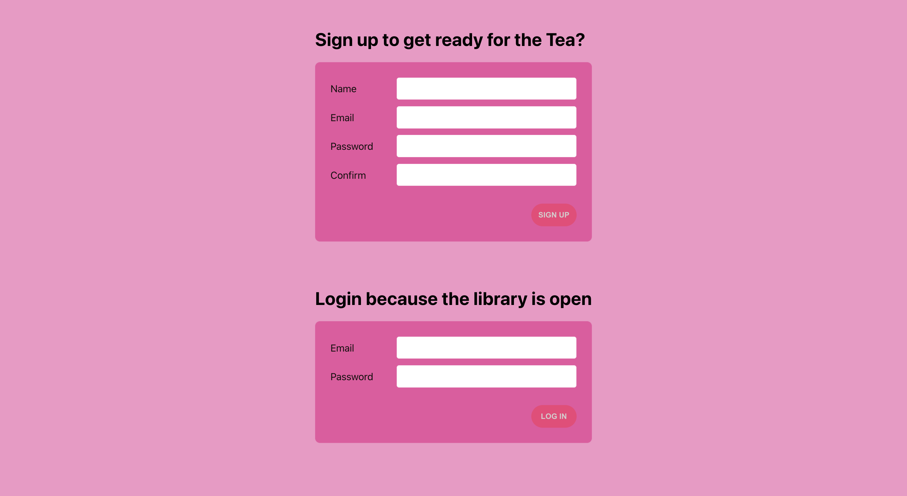
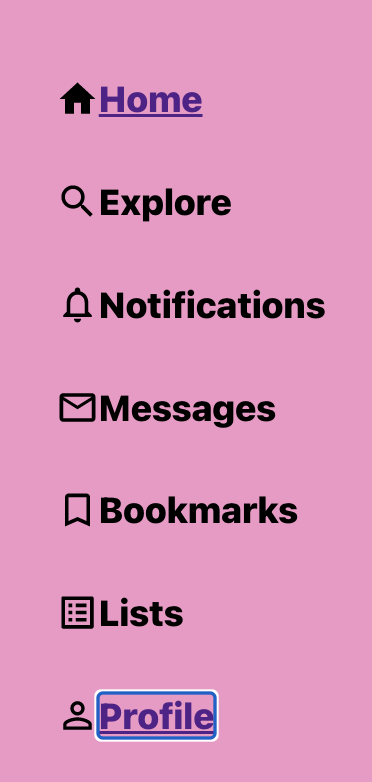
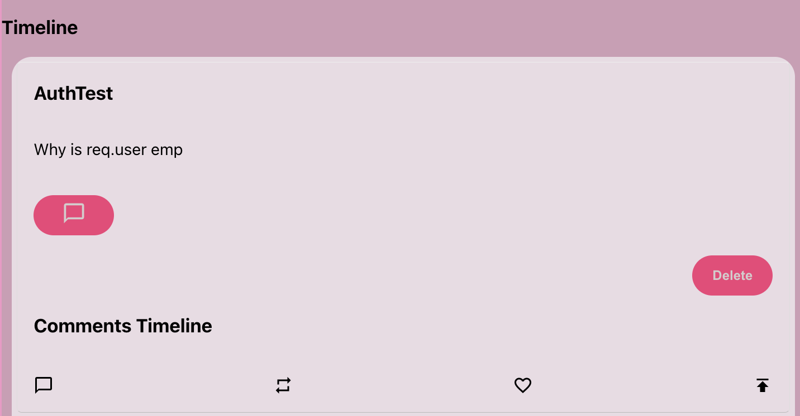

# Snatch N Tea


### Heroku Live : [https://snatch-n-tea.herokuapp.com/](https://git.heroku.com/snatch-n-tea.git)
### GitHub Repo: [https://github.com/daimes111/snatch_n_tea.git](https://github.com/daimes111/snatch_n_tea.git)
### GitHub Live: [https://daimes111.github.io/snatch_n_tea/](https://daimes111.github.io/snatch_n_tea/)

---
# Getting Started with Snatch N' Tea

Snatch N' Tea was initally thought to be an interactive wig store, gossip column, and workout blog all in one form. Users would be able to purchase wigs for regular use or in order to boost a post. I would like to implement the wig snatching, but did not get the chance. Users can anonomoulsy post their gossip as Gossip girl, can comment on each others post

---
## Where to Start on the front end???

> If a user is brand new, they will sign up and will first be prompted to the clients profile (in progress). Currently having trouble with the authorization. I currently am getting a token, but by users-service token is coming back as null event with a token on the page. 

---
## How to start the backend and the frontend?
    ### `npm run server`
    ### `npm run client`

---
## Once logged in

> Once a user is logged in the home page will show the posts headers as well as the time line of post. Most recent posts on top with .reverse. Each of the posts have the capability to have a comment added to it and the comments will be listed the same as the post (most recent on top). But with the comments we only want the comments for a specific post, so we add that id. 

**Posts**
```
 const getPosts = async () => {
    try {
      const response = await fetch('/api/posts')
      const data = await response.json()
      setPosts(data.reverse())
    } catch (err) {
      console.error(err)
    }
  }
```
**Comments**
```
 const getComments = async () => {
        try {
            const response = await fetch(`/api/comments/${post._id}`)
            const data = await response.json()
            setComments(data.reverse())
        } catch (err) {
            console.error(err)
        }
    }
```

---
## Auth vs conditionals

> Although there are erros with auth, with conditionals I was able to make it were if the post.username does not match the user.name, the delete button does not appear and they are unable to make any edits on the post. Currently if a user posts anonymously they are still able to delete or edit. I'd like to have it where if you post to Gossip Girl, you lose the capability to edit or delete. 

```
  <input
                style={{ display: showInput && user.name === post.username ? 'block' : 'none' }}
                type='text'
                defaultValue={post.post}
                onKeyDown={(e) => {
                    if (e.key === 'Enter') {
                        updatePost(post._id, post.post = e.target.value)
                        setShowInput(!showInput)
                    }
                }}
            />
```

```
 {user.name === post.username ?
                <button style={{ display: showButton ? 'block' : 'none' }} onClick={(() => deletePost(post._id))}>Delete</button>
                : ""
            }
```
---
## Icon imports
> These icons were used throughout the project in multiple areas
```
import HomeIcon from "@mui/icons-material/Home";
import SearchIcon from "@mui/icons-material/Search";
import NotificationsNoneIcon from "@mui/icons-material/NotificationsNone";
import MailOutlineIcon from "@mui/icons-material/MailOutline";
import BookmarkBorderIcon from "@mui/icons-material/BookmarkBorder";
import ListAltIcon from "@mui/icons-material/ListAlt";
import PermIdentityIcon from '@mui/icons-material/PermIdentity';
```


---
## Unsolved Problems
> It shows that I have a token from the function getToken(), but when called in users-service, it comes through as null.

**Issue solved!**
>My get requests for the comments and post needed to be called so that the token would go through with the request
```
import sendRequest from '../../utilities/send-request'

const getPosts = async () => {
    try {
        const response = await sendRequest('/api/posts')
        setPosts(response)
    } catch (error) {
        console.error(error)
    }
}
```

> Still need to work on styling. Items overlap when screen gets smaller


> Changed how my add comment worked and it messed up my styling. This is what it looked like before


## Project enhancements?
> A feature where users send there post to gossip girl and lose all auth on that post
> Likes and wigs. If a user has a certain amount of likes or wigs their post would be most favorites
> Users can snatch wigs from another users
> Update profile page
> Individual user page
> Search functionality 

---
## Technologies used
- Node.js
- React
- JSX
- Express
- Mongo
- JSON Webtoken

---
## Planning
### [Trello](https://trello.com/b/GPk7urTA/snatch-n-tea)  
### [ERD:](https://lucid.app/lucidchart/c801b2ba-08ed-41a5-9b21-843f06fb2ded/edit?page=0_0&invitationId=inv_ba1ec1d9-b96b-4b88-90dd-2cbf219227c3#) 